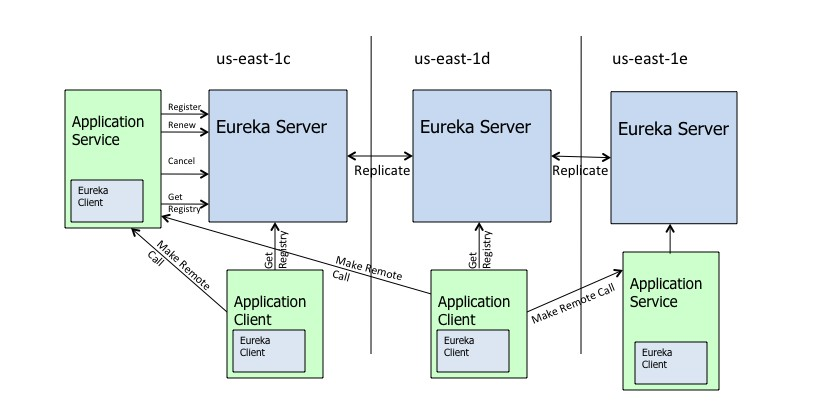
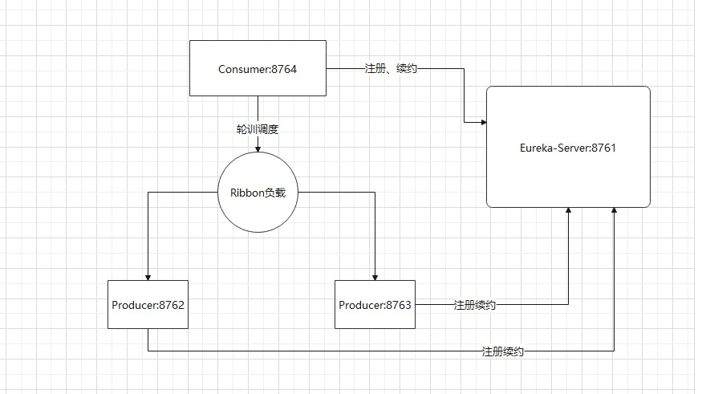

#SpringCloud学习
##1. Eureka知识
### 1.1 Eureka-server 增加 security认证
    第一步、引入对应的pom依赖，并在yml文件中，加入安全验证的账号和密码
    第二步、eureka-client在访问服务端时，需要在url中加入账号名和密码
### 1.2 Eureka-server 自我注册问题
    在application.yml配置文件中，增加如下配置：
    eureka.client.register-with-eureka    //表示是否将自己注册到Eureka Server
    eureka.client.fetch-registry         //表示是否从Eureka Server获取注册的服务信息
### 1.3 Eureka-server 仪表盘
    默认仪表盘是开启的，可通过配置文件去禁用，或者修改仪表盘的访问path
    dashboard:   # 仪表盘的path设置和是否开启设置，默认是开启的，访问地址默认是ip:port
        path: /dashboard
        enabled: true
### 1.4 Eureka 的架构图

### 1.4 Eureka的自我保护机制
    Eureka服务端会检查最近15分钟内的所有Eureka实例正常心跳比例,如果低于85%,则会触发保护机制，短暂性的将失效的
    失效的服务保护起来，不会删除、也不会过期，但是这些服务不是永远不会过期，Eureka服务端会每隔60s检查下服务的健康状态，
    若这些失效的服务在90s后还未恢复，则将这些服务从注册表中剔除。并关闭自我保护机制。
    
    为什么会有自我保护机制的原因：
        有些Eureka客户端是正常使用，但是由于网络问题，导致Eureka服务端和客户端无法进行正常通信，而导致的心跳检测失败。
      从而将客户端服务从注册表中剔除，不太合理，因为Eureka客户端只有在服务启动的时候，才会向Eureka服务端端注册。从而增加自我保护机制。
      
     通过以下配置关闭自我保护机制，默认是开启自我保护机制
     eureka.server.enable-self-preservation = false
     
### 1.5 单机高可用
    详情查看eureka服务端单机高可用配置文件

### 1.6 多机高可用

## 2、Ribbon负载均衡学习
    Ribbon主要是负责请求的分发，比如请求的微服务是集群的，客户端发起请求，Ribbon会根据不通的
    负载策略将请求分发到不通的服务端，从而缓解服务端的压力。且Ribbon是基于客户端的负载均衡。
    这点与Nginx有所不同
    
### 2.1 消费者微服务通过Ribbon负载均衡调用生产者微服务演示案例
    结构图如下：

    
    
    需要在消费者微服务的RestTemplate增加@LoadBalanced注解。
    请求地址填写注册到Eureka服务的名称，若填写ip,否则会报在EurekaServer端找不到对应实例。
    报错信息：No instances available for localhost
 
 ### 2.2 Ribbon消费者微服务通过配置类设置，使访问多个微服务访问的负载策略不同
    详情见spring-cloud-ribbon-consumer项目
    注意：Ribbon Rule，但是不能够和启动类同一个包下面，否则他们都会公用同一个策略。
    
 ### 2.3 Ribbon负载策略模式详解 
    
    模式详解：
    1、RoundRobinRule 轮询
    2、RandomRule 随机
    3、RetryRule 轮询重试
    4、WeightedResponseTimeRule 响应速度权重
    5、BestAvailabledRule 最优可用，选择并发最小的
    6、AvailabilityFilteringRule 先过滤不可用的实例，其次选择并发最小的
    7、ZoneAvoidanceRule 复合判断server所在区域的性能和server的可用性选择服务器。(默认)
 
 ### 2.4 Ribbon通过application.yml配置负载策略
    详情见spring-cloud-ribbon-consumer项目配置文件
    
  
 
# 3. Feign的使用
    在实现的效果上来说 Feign = RestTemplate+Ribbon+Hystrix 
    
# 4.Hystrix 断路器

## 4.1 隔离策略
    为什么要做资源隔离：
        因为服务与服务之间是相互调用的，若某个服务宕机了，导致资源一直被占用，进而使其他服务受到影响，带来雪崩效应。
        
        1、线程池    
        2、信号量
        
两种隔离策略对比：

|  | 线程池隔离 | 信号量隔离 |
| :----:| :----: | :----: |
| 线程     | 与调用线程非相同线程     | 与调用线程相同（jetty线程） |
| 开销     | 排队、调度、上下文开销等  | 无线程切换，开销低         | 
| 异步     | 支持                  | 不支持                   |  
| 并发支持 | 支持（最大线程池大小）    | 支持（最大信号量上限）      | 
     

 